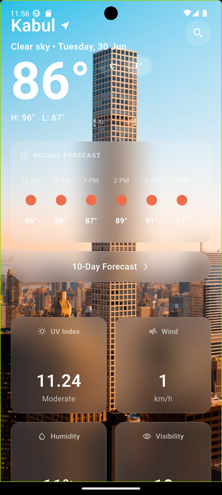
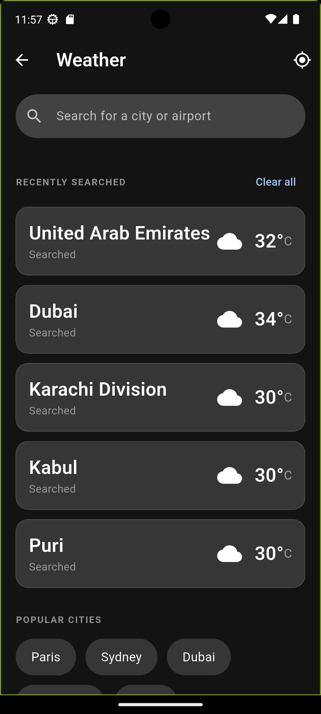
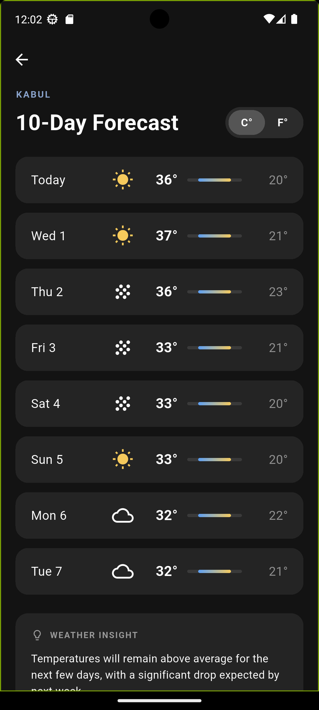

# 🌤️ Weather247

> A premium, production-ready weather application built with Flutter featuring real-time GPS tracking, dynamic glassmorphism UI, 10-day forecasts, and scalable architecture.

**Clean Code • Reactive UI • Hardware Integration • API-Driven**

---

## ✨ Overview

Weather247 is a feature-rich weather dashboard that demonstrates advanced Flutter development concepts. It goes beyond simple API fetching by integrating hardware sensors, cloud databases, and complex UI rendering techniques to create a seamless user experience.

### Highlights

- 🌍 **Real-time GPS Weather** using device location
- 🌦️ **OpenWeather One Call 3.0 API** integration
- ⚡ **Reactive State Management** with GetX
- ☁️ **Firebase Firestore** for recently searched locations
- 🎨 **Modern Glassmorphism UI**
- 📅 **10-Day Weather Forecast**
- 🌡️ **Instant Celsius/Fahrenheit Conversion**
- 📱 **Responsive & Smooth User Experience**

> **Recruiter Note:** This project showcases production-level Flutter practices including environment variable security (`.env`), scalable architecture, robust JSON parsing, Firebase integration, and solutions for complex Flutter rendering issues.

---

## 🧩 Features

| Feature | Description |
|---------|-------------|
| 🌍 **Live GPS Weather** | Automatically requests location permission and fetches weather based on the user's current location. |
| 🔍 **Smart Search** | Search cities using Geocoding API with Firebase-powered recent searches. |
| 🎨 **Dynamic Backgrounds** | Weather-specific backgrounds that change instantly according to current conditions. |
| 🌡️ **10-Day Forecast** | Beautiful daily forecast with temperature range indicators. |
| 💡 **Weather Insights** | Generates intelligent weather summaries based on upcoming forecast trends. |
| ⚙️ **Unit Toggle** | Instantly switch between Celsius and Fahrenheit throughout the application. |

---

# 📱 Screenshots

> Save your screenshots inside **`assets/screenshots/`** using the filenames below.

<table>
<tr>
<td align="center"><b>🏠 Home Dashboard</b></td>
<td align="center"><b>🔍 Smart Search</b></td>
</tr>

<tr>
<td>

<!-- Replace with:

-->
</td>

<td>

<!-- Replace with:

-->
</td>
</tr>

<tr>
<td align="center"><b>📅 10-Day Forecast</b></td>
<td align="center"><b>🌦️ Weather Details</b></td>
</tr>

<tr>
<td>

<!-- Replace with:

-->
</td>

<td>

<!-- Replace with:

-->
</td>
</tr>

</table>

**Expected folder structure**

```text
assets/
└── screenshots/
    ├── home.png
    ├── search.png
    ├── forecast.png
    └── weather_details.png
```

---

# 🏗 Architecture

```text
UI (Views)
      │
      ▼
GetX Controllers
(State & Business Logic)
      │
      ▼
Models
(JSON Parsing)
      │
      ▼
Services
(API • Firebase • Location)
```

### Project Layers

| Layer | Responsibility |
|-------|----------------|
| **Views** | Screens and UI widgets |
| **Controllers** | State management, API calls, GPS logic |
| **Models** | JSON serialization and object mapping |
| **Services** | Firebase, API configuration, environment variables |

---

# ⚡ State Management (GetX)

Weather247 uses **GetX** for efficient state management.

Example:

```dart
var isCelsius = true.obs;

void toggleUnits() {
  isCelsius.value = !isCelsius.value;
}

String formatTemp(double tempC) {
  return isCelsius.value
      ? "${tempC.round()}°"
      : "${((tempC * 9 / 5) + 32).round()}°";
}
```

Only the widgets depending on the observable rebuild, resulting in smooth UI updates.

---

# 📂 Project Structure

```text
lib/
│
├── main.dart
│
├── data/
│   └── models/
│       └── weather_model.dart
│
├── view/
│   ├── home/
│   │   ├── home_screen.dart
│   │   ├── weather_controller.dart
│   │   └── ten_days_screen.dart
│   │
│   └── search/
│       ├── search_cities_screen.dart
│       └── search_cities_controller.dart
│
└── services/
    ├── api_service.dart
    ├── firebase_service.dart
    └── env_service.dart
```

---

# 🎨 UI & UX

### Glassmorphism

- Extensive use of `BackdropFilter`
- Smooth blur effects
- Optimized with `RepaintBoundary`
- Custom scroll physics to avoid Flutter clipping issues

### Typography

- **Plus Jakarta Sans**
- Clean, modern appearance
- Optimized readability for weather data

### Assets

- Local weather background images
- Zero-latency loading
- Offline-ready assets

---

# 🛠 Tech Stack

- Flutter
- Dart
- GetX
- Firebase Firestore
- Geolocator
- OpenWeatherMap API
- Flutter Dotenv
- HTTP
- Intl

---

# 🚀 Getting Started

## Prerequisites

- Flutter SDK 3.x
- Dart 3.x
- Firebase Project
- OpenWeatherMap API Key (One Call 3.0)

---

## Installation

### 1. Clone the repository

```bash
git clone https://github.com/yourusername/weather247.git
cd weather247
```

### 2. Install dependencies

```bash
flutter pub get
```

### 3. Configure Environment Variables

Create a `.env` file in the project root.

```env
OPENWEATHER_API_KEY=your_api_key_here
```

### 4. Configure Firebase

Add your Firebase configuration files:

Android

```text
android/app/google-services.json
```

iOS

```text
ios/Runner/GoogleService-Info.plist
```

### 5. Run the application

```bash
flutter run
```

---

# 🧪 What This Project Demonstrates

| Skill | Demonstration |
|--------|---------------|
| REST API Integration | OpenWeather One Call & Geocoding APIs |
| JSON Parsing | Complex nested model mapping |
| Firebase | Cloud Firestore integration |
| Native Device Features | GPS location & permissions |
| State Management | GetX reactive architecture |
| Performance Optimization | RepaintBoundary & optimized rebuilds |
| Clean Architecture | Separation of UI, Logic, Models & Services |
| Secure Configuration | Environment variables with `.env` |

---

# 🛣 Roadmap

- [ ] Settings page
- [ ] Weather trend charts
- [ ] Offline caching using Hive/Sqflite
- [ ] Severe weather push notifications
- [ ] Multiple saved locations
- [ ] Dark/Light theme support

---

# 📄 License

This project is licensed under the **MIT License**.

---

# ⭐ Support

If you found this project helpful or learned something from it, consider giving it a ⭐ on GitHub.

It helps others discover the project and supports future improvements.

